# 飲食店予約サービス -Rese-

## 目次
| 番号 | 項目 |
|:-:|:--|
| 1 | [URL](#1url) |
| 2 | [サービス概要](#2サービス概要) |
| 3 | [主な使用技術](#3主な使用技術) |
| 4 | [システム構成図](#4システム構成図) |
| 5 | [環境構築手順](#5環境構築手順) |
| 6 | [機能一覧](#6機能一覧) |
| 7 | [使用イメージ](#7使用イメージ) |
| 8 | [工夫した点](#8工夫した点) |
| 9 | [苦労した点](#9苦労した点) |
| 10 | [備考](#10備考) |

***
## 1．URL
以下のURLからアクセス可能です(独自ドメインの取得、ならびに常時SSL化はおこなっておりません)。

http://d2kkcsthu9lh7p.cloudfront.net/

(フロントエンドのリポジトリは[こちら](https://github.com/AmpinNoHito/Rese-frontend))

***
## 2．サービス概要
架空の飲食店予約サービスです。  
基本的な機能として、顧客は店舗や日時、注文するコースなどを指定して飲食店の予約をすることができます。  
また、店舗代表者は管轄店舗の情報管理や、予約状況の確認などをおこなうことも可能です。  
(その他の機能については[機能一覧](#6機能一覧)を参照のこと)

***
## 3．主な使用技術
OS
+ Windows 11 (WSL2 Ubuntu-20.04.4)

フロントエンド
+ Typescript 4.7.3
+ Sass 1.52.1
+ Nuxt.js 2.15.8
+ Yarn 1.22.15
+ Jest 28.1.2
+ Husky 8.0.1

バックエンド
+ PHP 7.4.3
+ Laravel 8.83.14
+ Composer 2.3.10

データベース
+ MySQL 8.0.29 (開発環境用)
+ Amazon RDS for MySQL 8.0.28 (本番環境用)

メール
+ Mailhog (開発環境用)
+ SendGrid (本番環境用)

インフラ、その他
+ Docker 20.10.14
+ Docker Compose 1.29.2
+ Apache 2.4.54
+ AWS (EC2, ALB, S3, CloudFront)
+ Github Actions
+ Stripe

***
## 4．システム構成図
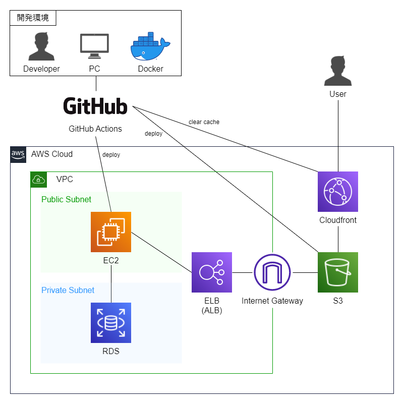

***
## 5．環境構築手順
#### **フロントエンド**
1．リポジトリをクローン
```
git clone https://github.com/AmpinNoHito/rese-frontend
```
2．Nuxtのルートディレクトリに移動
```
cd rese-frontend
```
3．パッケージをインストール
```
yarn install
```
4．.envファイルを作成 (コメントを参考に適宜必要な値を設定してください)
```
cp .env.example .env
```
5．開発用サーバーの立ち上げ
```
yarn dev
```

#### **バックエンド**
1．リポジトリをクローン
```
git clone https://github.com/AmpinNoHito/rese-backend
```
2．Laravelのルートディレクトリに移動
```
cd rese-backend/src
```
3．パッケージをインストール
```
composer install
```
4．.envファイルを作成 (コメントを参考に適宜必要な値を設定してください)
```
cp .env.example .env
```
5．アプリケーションキーを生成
```
php artisan key:generate
```
6．画像保存用のディレクトリを作成
```
mkdir storage/app/public/images
```
7．storageディレクトリの権限を変更
```
chmod -R 777 storage/
```
8．コンテナを起動
```
docker compose up -d
```
9．appコンテナに入る
```
docker exec -it rese-backend bash
```
10．マイグレーションとシーディング[^1]
```
php artisan migrate --seed
```
11．シンボリックリンクを作成
```
php artisan storage:link
```

[^1]: エラーが発生する場合はキャッシュをクリアしてから再試行してみてください。
***
## 6．機能一覧
#### **認証関連**
+ ユーザー登録
  + メールアドレスの確認が完了したのちログインが可能
+ ログイン
+ ログアウト

#### **基本機能**
+ 店舗一覧表示
+ 店舗詳細表示
+ 店舗検索
  + エリア、ジャンル、店名によるAND検索

#### **会員限定機能**
+ 来店予約(新規予約、予約内容変更、キャンセル)
  + 日時、人数、注文するコースを指定(コースの指定は任意)
+ 来店確認用QRコードの表示
+ 事前支払い
  + 注文するコースが指定されている場合のみ事前支払いが可能
  + Stripeを介したクレジット決済[^2]
+ 店舗のお気に入り登録・お気に入り解除
+ レビュー機能(投稿・更新・削除)
  + 予約済み、かつ来店済みの店舗に対してレビューを投稿することが可能
+ 予約リマインダー
  + 予約当日の朝9時にリマインダーメールを送信

#### **店舗責任者限定機能**
+ 店舗情報編集(新規登録、更新)
+ 店舗の予約状況確認
+ 各店舗に投稿されたレビュー内容の確認
+ 各店舗のコース登録、削除
+ 来店確認用QRコードの読み取り[^3]
  
#### **管理者限定機能**
+ 店舗責任者の新規登録
  + 責任者はメールアドレスの確認が完了したのちログインが可能

[^2]: テストモードのため引き落としは実行されません。また、テスト用のカード番号(4242 4242 4242 4242)のみが利用可能です。

[^3]: 常時SSL化していないため、本番環境ではデバイスのカメラを起動することができません。そのため、今のところ本機能はlocalhostでのみ利用可能です。

***
## 7．使用イメージ
#### **店舗一覧**


#### **メニュー**


#### **ログイン**
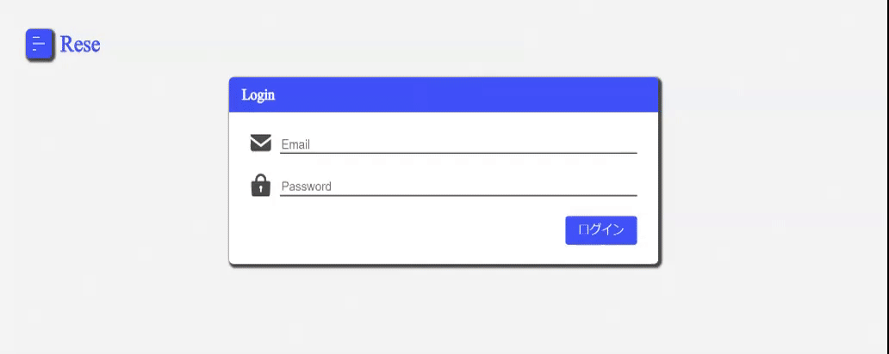

#### **予約画面**
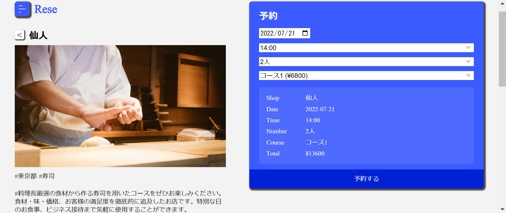

#### **予約内容変更画面**
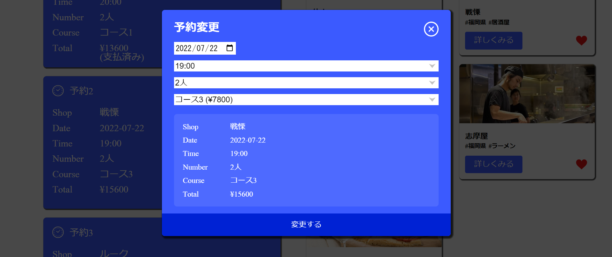

#### **事前支払い画面**
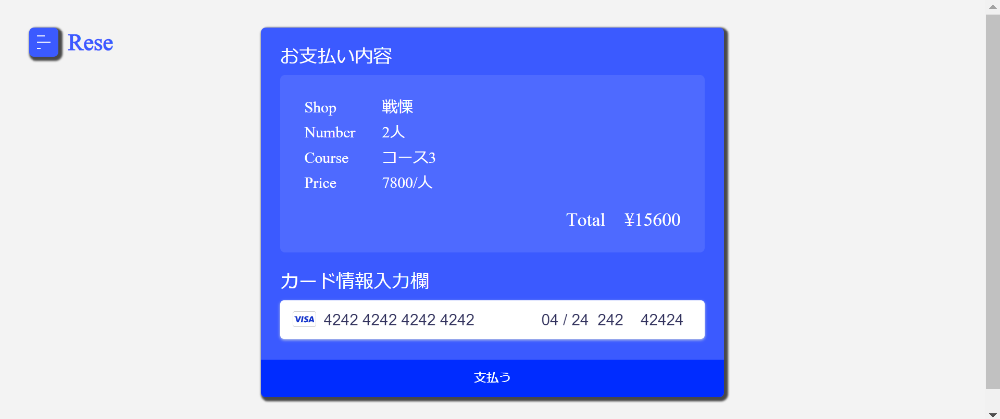

#### **マイページ**
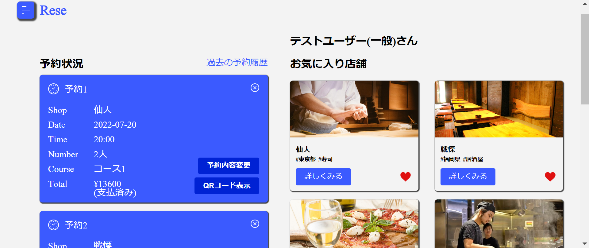

#### **レビュー投稿画面**
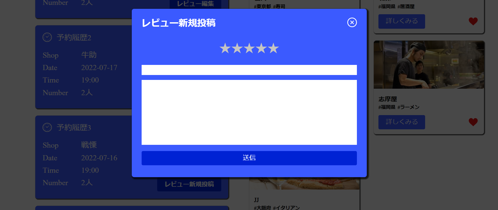

#### **店舗詳細画面(店舗代表者用)**
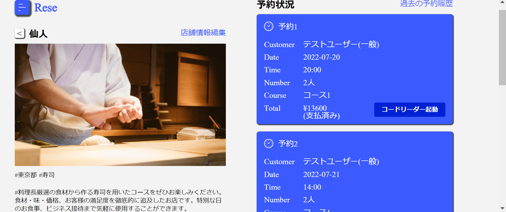
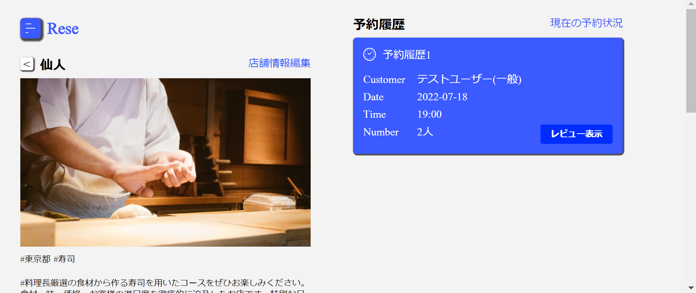
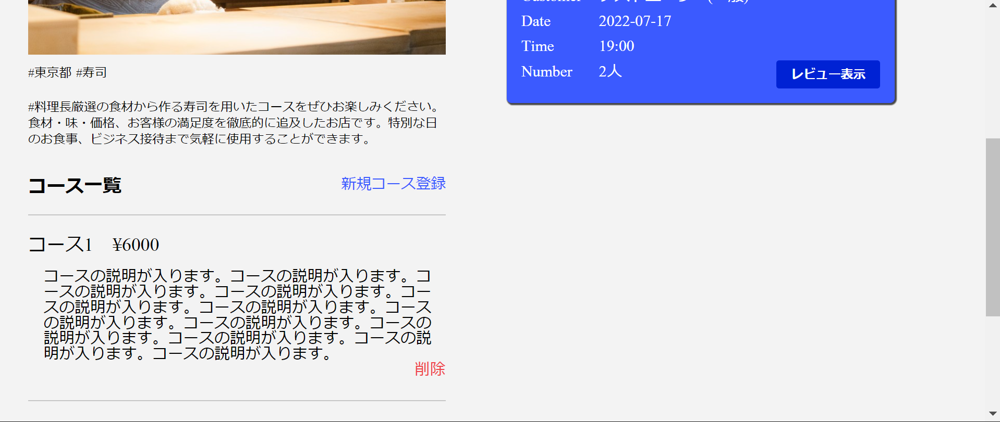

#### **新規店舗登録画面**
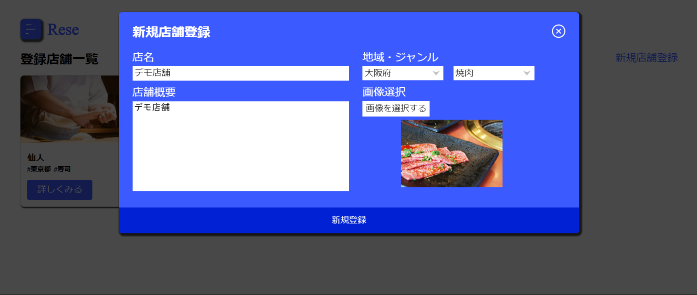


***
## 8．工夫した点
#### **フロントエンド**
- アトミックデザインに基づいたコンポーネント設計をおこなうことで、デザインに統一感をもたせると同時に余分なコードの重複を減らしました。
- コンポーネント間のデータ受け渡しをすべてpropsでおこない、伝達方向を親コンポーネントから子コンポーネントへと限定することで、データの流れを追いやすくしました。
- スマホ用のレイアウトでは、タッチ操作がしやすいようボタン等の幅を広めに取るようにしました。

#### **バックエンド**
- APIリソースを活用し、必要とされるデータのみを成形済みの状態でフロントエンドに返すようにしました。これにより、フロントエンドの処理を簡素化することができました。

#### **共通**
- エラー処理用の共通関数を用意することでコードの重複を減らしました。
- サービス層とリポジトリ層を設けて責務を分離し、保守性の高いコードを追求しました。
- DIとモックを活用し、各クラスのユニットテスト結果が他のクラスに依存しないようにしました。

***
## 9．苦労した点
- SPAをS3+Cloudfrontで公開する際にエラーが頻発し、原因がなかなかわからず特に大変でした。
  - トップページ以外のページでリロードすると403エラーが発生 → カスタムエラーレスポンスの設定により解決([こちらの記事](https://dev.classmethod.jp/articles/s3-cloudfront-spa-angular-403-access-denied/)を参考にさせていただきました。)
  - APIを叩くとエラーが発生 → axiosのproxyがS3 + Cloudfrontの構成でうまく動作しないことが判明。proxyの設定を削除することで解決

***
## 10．備考
#### **初期データについて**
- シーディングを実行すると、初期データとして以下のユーザーが登録されます。なお、ログイン用のパスワードはすべて'password'です。
  - テストユーザー(一般)
    - メールアドレス: test@ex.com
    - パスワード: password
  - テストユーザー(店舗代表者1~20)
    - メールアドレス: representative[1~20]@ex.com[^4]
  - テストユーザー(管理者)
    - メールアドレス: admin@ex.com

#### **画像ファイルの保存先について**
- 開発環境ではLaravelのstorageを、本番環境ではAWSのS3を保存先としています。

#### **データベースについて**
- 開発環境ではDockerで用意したMySQLサーバーを、本番環境ではAWSのRDSを利用しています。
- ユニットテスト用のMySQLサーバーもDockerで立ち上げています。開発環境でテストを実行する際は.env.testingファイルを適宜ご用意ください(GitHub Actions上で自動テストが実行されるため、基本的には開発環境でのテストは不要です)。

#### **メール送信について**
- 開発環境ではMailhogを利用しています。架空のメールアドレスでメール送信機能を確認することが可能です。
- 本番環境ではSendGridを利用しています。こちらは実在するメールアドレスでなければメール送信機能を確認することができません。
- リマインダーメール送信用のタスクスケジューラーには'reminder:send'というartisanコマンドを登録しています。このコマンドを利用してリマインダーメールの動作確認を行うことが可能です。

#### **フロントエンドのテストとデプロイ**
- huskyを導入し、git push時に自動的にテストが走るように設定しています。テストをすべてpassした場合のみpushが実行されます。
- pushが実行されると、S3のappディレクトリにソースコードがアップロードされ、Cloudfrontのキャッシュが削除されます。

#### **バックエンドのテストとデプロイ**
- 'testbranch'という名前のブランチにgit pushが実行されると、差分の内容に応じてテストが実行されます。
  - docker関連のファイルが更新された場合、dockerのビルドが問題なく実行されるかを確認するテストが実行されます。
  - srcディレクトリ配下のファイルが更新された場合には、マイグレーションやシーディングが問題なく実行されるかが確認されたのち、PHPUnitを用いたユニットテストが実行されます。
- 'testbranch'の差分がmainブランチにマージされると自動デプロイが実行されます。


[^4]: ブラケット内の範囲で数字をひとつ選択してください(e.g. 店舗代表者5としてログインする場合はrepresentative5@ex.com)。

***
[↑目次へ](#目次)